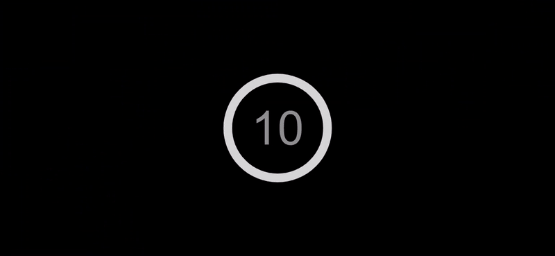

# New Year Countdown

This is a simple countdown timer app built with React. When the app is first loaded, it displays a countdown timer that counts down from 10 seconds. When the timer reaches 0, the app displays a message saying "Happy New Year".

The app uses the framer-motion library to add smooth transitions and animations.

| Demo  | 
| -----------------| 
|  | 

### Running the app

To run the app, follow these steps:

* Clone the repository: 
```sh
git clone https://github.com/jaafarhawli/new-year.git
```
* Navigate to the project directory: 
```sh
cd frontend
```
* Install the dependencies: 
```sh
npm install or yarn install
```
* Start the app: 
```sh
npm start or yarn start
```

The app should now be running on http://localhost:3000.
